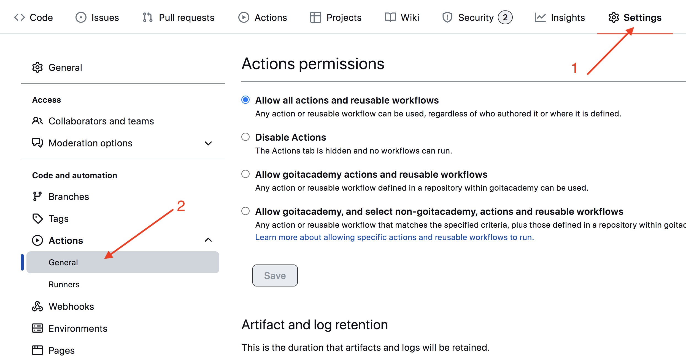
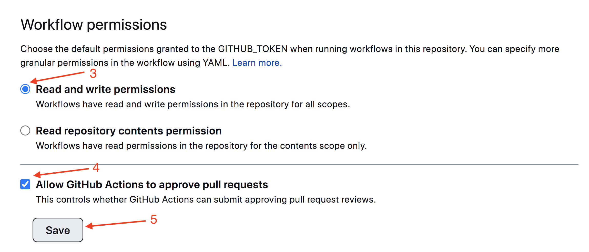
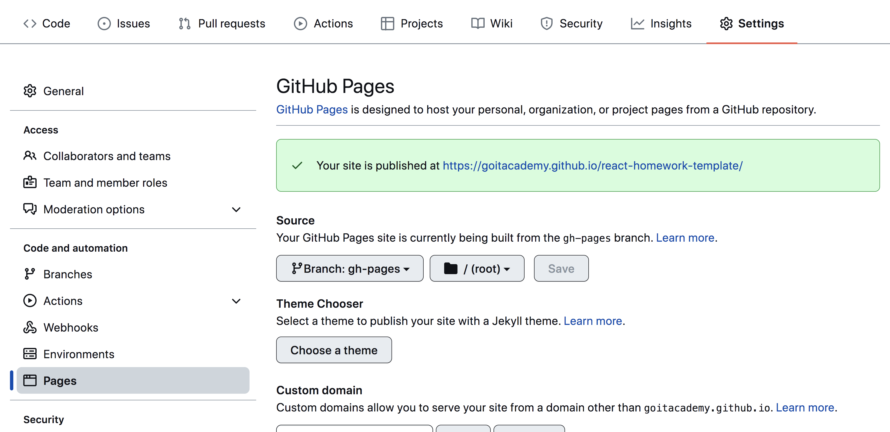
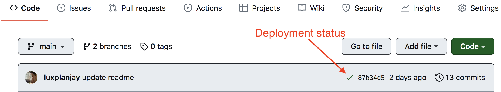

# Parcel template

Este proyecto fue creado con Parcel. [Consulte la documentación](https://parceljs.org/).
para conocer y personalizar las funciones adicionales.

## Preparación de un nuevo proyecto

1. Asegúrate de que la versión LTS de Node.js está instalada en tu equipo.
   [Descárgala e instálala](https://nodejs.org/en/) si es necesario.
2. Clona este repositorio.
3. Cambie el nombre de la carpeta con `parcel-project-template` por el nombre de tu proyecto.
4. Crea un nuevo repositorio vacío en GitHub.
5. Abre el proyecto en VSCode, ejecuta el terminal y enlaza el proyecto con el repositorio de GitHub
   [según las instrucciones](https://docs.github.com/en/get-started/getting-started-with-git/managing-remote-repositories#changing-a-remote-repositorys-url).
6. Instala las dependencias del proyecto en el terminal con el comando `npm install`.
7. Inicia el modo de desarrollo, ejecutando el comando `npm start`.
8. Ve a la dirección [http://localhost:1234](http://localhost:1234) en tu navegador.
   Esta página se recargará automáticamente después de guardar los cambios en los 
   archivos del proyecto.

## Archivos y carpetas

- Todos los partials de los archivos de estilo deben estar en la carpeta `src/sass`
  y ser importados en los archivos de estilos de la página. Por ejemplo, para
 `index.html` el archivo de estilos se llama `index.scss`.
- Añade las imágenes a la carpeta `src/images`. El ensamblador las optimizará, 
  pero sólo cuando se cargue la versión de producción del proyecto. Todo esto
  se hace en la nube, para no sobrecargar tu ordenador, ya que puede tardar 
  mucho en máquinas poco potentes.

## Deploy

Para configurar un proyecto para ser implementado, hay algunos pasos adicionales 
para configurar tu repositorio. Ve a la pestaña `Settings` y en la subsección
`Actions`, selecciona la opción `General`.



Baja hasta la última sección, asegurándote de que las opciones esten seleccionadas
como en la siguiente imagen, y haz clic en `Save`. Sin estas opciones, la compilación
no tendrá suficientes permisos para automatizar el proceso de implementación.



La versión de producción del proyecto se compilará e implementará automáticamente 
en GitHub Pages, en la rama `gh-pages`, cada vez que se actualice la rama `main`.
Por ejemplo, después de un push directo o de un pool request aceptado. Para
ello, edita el campo `homepage` y el script `build` en el archivo `package.json`,
sustituyendo `your_username` y `your_repo_name` por los tuyos propios, y envía
los cambios a GitHub.

```json
"homepage": "https://your_username.github.io/your_repo_name/",
"scripts": {
  "build": "parcel build src/*.html --public-url /your_repo_name/"
},
```

A continuación, hay que ir a la configuración del repositorio de GitHub 
(`Settings` > `Pages`) y seleccionar que la versión de producción de los archivos
se distribuya desde la carpeta `/root` de la rama `gh-pages`, si no se hizo automáticamente.



### Estado del deploy

El estado del deploy del último commit se indica con un icono junto a su identificador.

- **Color amarillo** - el proyecto se está compilando y desplegando.
- **Color verde** - el deploy se completó con éxito.
- **Color rojo** - Se ha producido un error durante el linting, la compilación o el deploy.

Se puede ver información de estado más detallada haciendo clic en el icono y 
en el enlace `Details` de la ventana desplegable.



### Página activa

Después de un tiempo, normalmente un par de minutos, la página activa se puede
ver en la dirección especificada en la propiedad `homepage`. Por ejemplo, aquí
está el enlace a la versión activa de este repositorio.
[https://goitacademy.github.io/parcel-project-template](https://goitacademy.github.io/parcel-project-template).

Si se abre una página en blanco, asegúrese de que no haya errores en la pestaña
`Console` relacionados con rutas incorrectas a los archivos CSS y JS del proyecto (**404**).
Lo más probable es que tenga un valor incorrecto para la propiedad `homepage` o el 
script `build` en el archivo `package.json`.

## ¿Cómo funciona?


1. Después de cada push a la rama `main` del repositorio GitHub, se ejecuta un 
   script especial (GitHub Action) del archivo `.github/workflows/deploy.yml`.
2. Todos los archivos del repositorio se copian en el servidor, donde el 
   proyecto se inicializa y se compila antes de ser desplegado.
3. Si todos los pasos tienen éxito, la versión de producción compilada de los
   archivos del proyecto se envía a la rama `gh-pages`. De lo contrario, el
   registro de ejecución del script indicará cuál es el problema.
