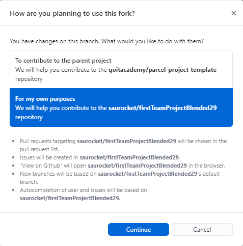
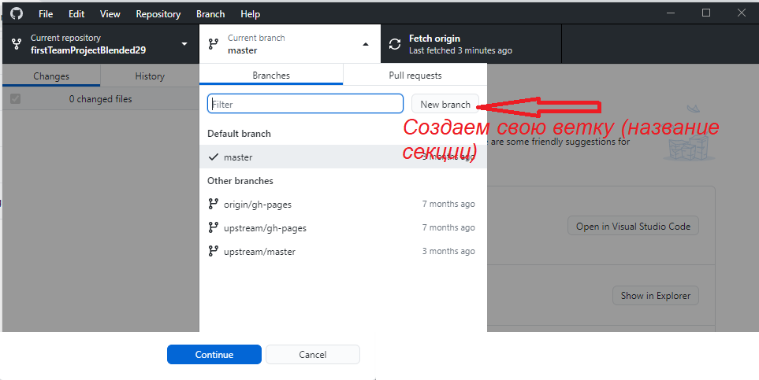
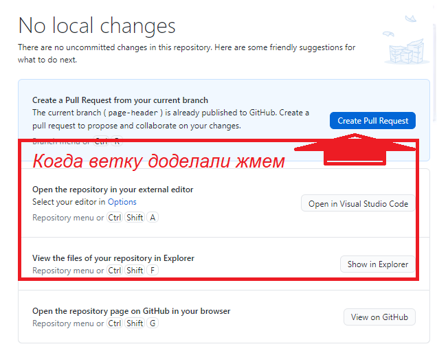
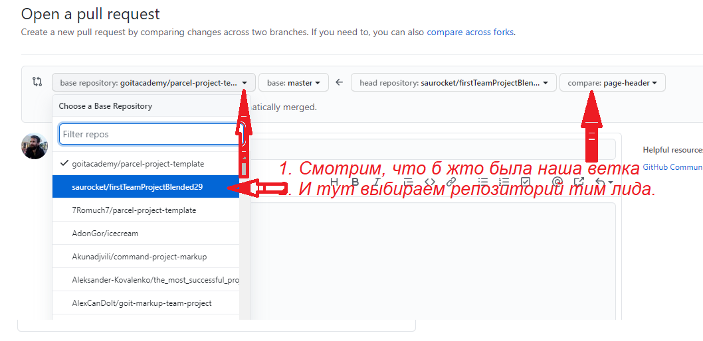
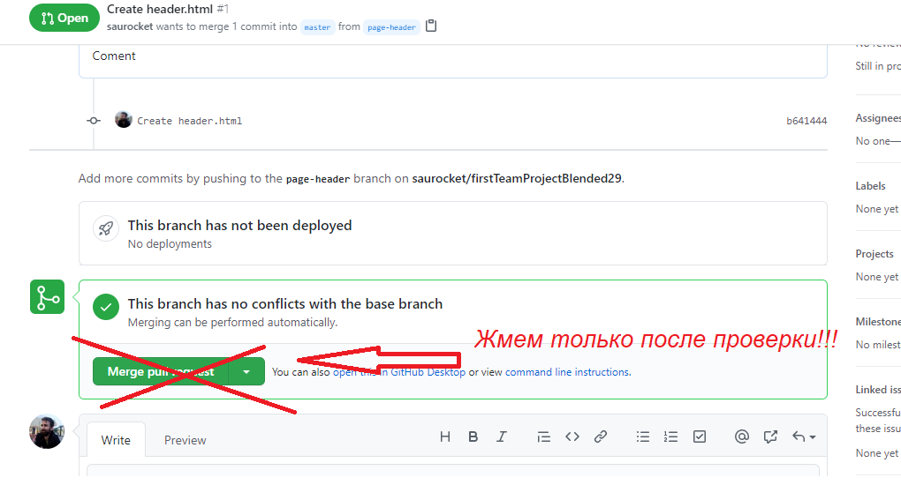
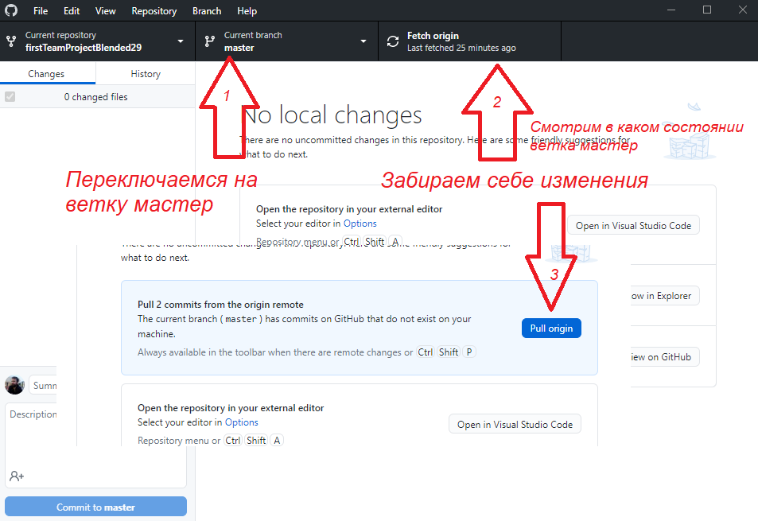

# Работа c GIT через Desktop

Каждый клонирует себе репозиторий из
[github](https://github.com/saurocket/firstTeamProjectBlended29).

В конце клонирования выскочит менюшка как показано на рисунке
 жмем _For my own purposes_

Каждый себе создает новую ветку, как показано на рисунке

Поработав на ветке и сделав свою секцию делем коммит и пул реквест как показано
на рисунках 

Merge жмем только после согласования 

Чтобы иметь октуальную версию проекта делаем так 
